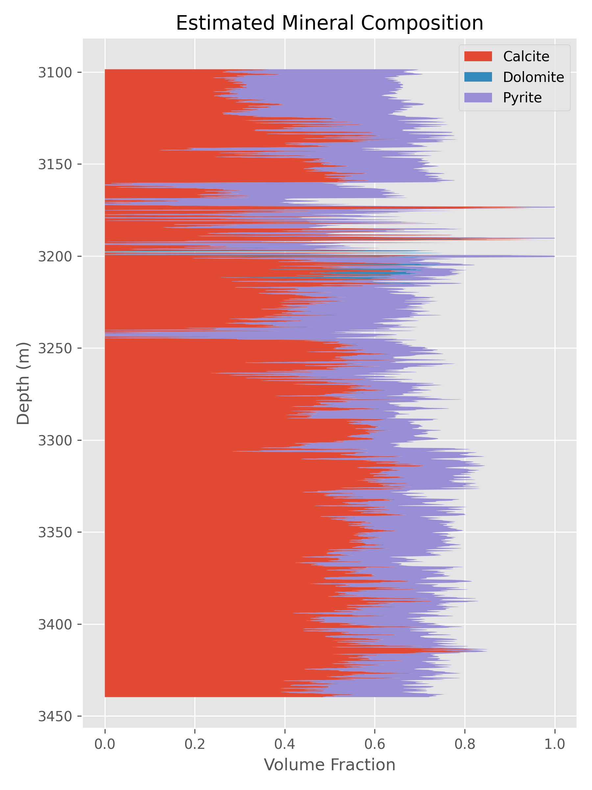
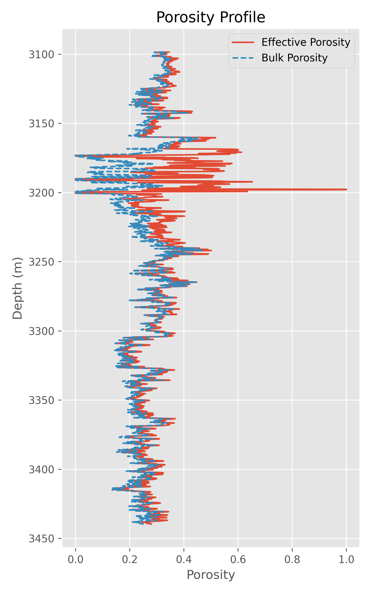
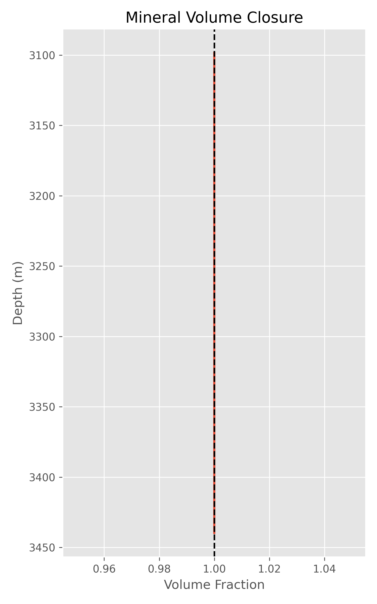
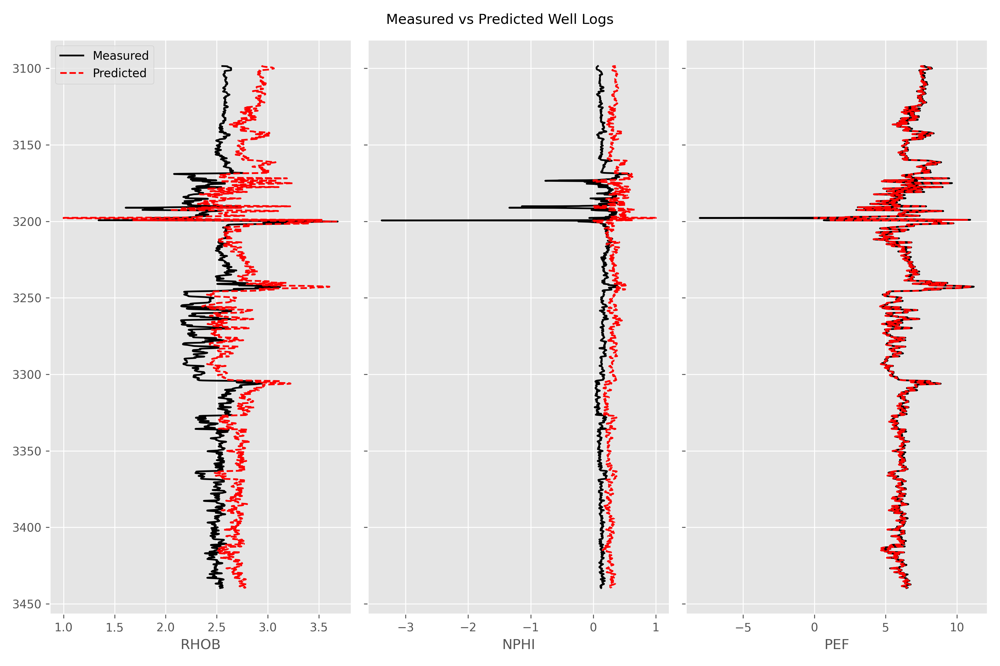

# Multimineral Analysis Using Well Logs

<p align="center">
  
</p>

<p align="center">
  <b>Optimization-based multimineral analysis using density, neutron porosity, and photoelectric well logs.</b>
</p>

---

## Overview

This project presents an optimization-based workflow for multimineral analysis of carbonate reservoirs using conventional well logs. The notebook estimates the volumetric fractions of calcite, dolomite, pyrite, and effective porosity from density (RHOB), neutron porosity (NPHI), and photoelectric factor (PEF) logs after applying shale correction.

The workflow employs constrained nonlinear optimization to minimize the mismatch between measured and predicted log responses while satisfying the mineral volume closure constraint.

---

## Features

- Well log preprocessing and quality control
- Shale correction for RHOB, NPHI, and PEF logs
- Constrained nonlinear optimization for multimineral inversion
- Estimation of:
  - Calcite Volume
  - Dolomite Volume
  - Pyrite Volume
  - Effective Porosity
- Volume closure verification
- RMSE-based inversion quality assessment
- Comparison of measured and predicted well log responses
- Automatic export of processed results and visualizations

---

## Workflow

```text
Input Well Logs
        │
        ▼
Data Cleaning
        │
        ▼
Shale Correction
        │
        ▼
Mineral End-Member Definition
        │
        ▼
Constrained Optimization
        │
        ▼
Mineral Volume Estimation
        │
        ▼
Quality Assessment
        │
        ▼
Plots & Result Export
```

---

## Mathematical Formulation

The optimization minimizes the difference between measured and predicted well log responses:

<p align="center">

min Σ (Observed Log − Predicted Log)²

Subject to

Vcalcite + Vdolomite + Vpyrite + φ = 1

</p>

where

- **Vcalcite** = Calcite volume fraction
- **Vdolomite** = Dolomite volume fraction
- **Vpyrite** = Pyrite volume fraction
- **φ** = Effective porosity

---

## Project Structure

```text
MultiMineral-Analysis/
│
├── MultiMineral-Analysis.ipynb
├── README.md
├── requirements.txt
├── .gitignore
└── outputs/
    ├── multimineral_analysis_results.csv
    ├── mineral_composition.png
    ├── porosity.png
    ├── volume_closure.png
    ├── rmse.png
    └── log_matching.png
```

---

## Required Input Data

The notebook expects a CSV file named:

```text
well_logs.csv
```

containing the following columns:

| Column | Description |
|----------|-------------|
| Depth | Measured Depth |
| RHOB | Bulk Density |
| NPHI | Neutron Porosity |
| PEF | Photoelectric Factor |
| Vsh | Shale Volume |

> **Note:** The input dataset is **not included** in this repository. Users can run the notebook by supplying their own well log dataset containing the required columns.

---

## Technologies Used

- Python
- NumPy
- Pandas
- SciPy
- Matplotlib
- Jupyter Notebook

---

## Output

The notebook generates:

- Estimated Calcite Volume
- Estimated Dolomite Volume
- Estimated Pyrite Volume
- Effective Porosity
- Bulk Porosity
- Volume Closure Analysis
- RMSE Evaluation
- Predicted Well Log Responses
- Processed CSV Results

### Generated Visualizations

| Mineral Composition | Porosity Profile |
|----------------------|------------------|
|  |  |

| Volume Closure | Measured vs Predicted Logs |
|----------------|----------------------------|
|  |  |

---

## Author

**Prem Kumar Singh**

B.Tech, Petroleum Engineering  
Indian Institute of Technology (ISM) Dhanbad
